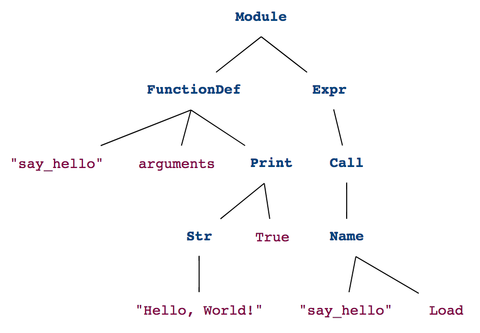

# user2code2vec

Embeddings for Profiling Students Based on Distributional Representations of Source Code. 

Full research paper presented at Learning Analytics & Knowledge 2019 Conference in AZ, USA ([LAK 2019](https://lak19.solaresearch.org/))

Please consider [citing](data/citations/azcona2019user2code2vec.md) this paper if you use any of the work.

## Representations

* [Program Vectors][vectors]

## code2vec

* [BOW (bag-of-words) Part I][bow_first], [BOW Part II][bow_second]
* [Embeddings Part I][emb_f], [Embeddings Part II][emb_s]

## user2code2vec

* [user2code2vec][user2code2vec]

## Utils

* [Viz an AST][viz]: An abstract syntax tree (AST) is a tree representation of the abstract syntactic structure of source code written in a programming language. In Python, we leverage the ast module to process trees of the Python abstract syntax grammar. Visualizations are made using a great [notebook](https://github.com/hchasestevens/show_ast) developed by H. Chase Stevens.

* [BOW (bag-of-words)][emb_example]: The bag-of-words model is a simplifying representation used in natural language processing and information retrieval (IR) where a text (such as a sentence or a document) is represented as the bag (multiset) of its words, disregarding grammar and even word order but keeping multiplicity. In order to grab these words from Python source code we can leverage the tokenize module, the tokenizer for Python source.  It provides a lexical scanner for Python source code.

* [Word Embeddings][emb_example]: Word embeddinga are feature learning techniques in NLP where words or phrases from the vocabulary are mapped to vectors of real numbers. Conceptually it involves a mathematical embedding from a space with one dimension per word to a continuous vector space with a much lower dimension. A common method to develop this mapping is fitting a Neural Network. We use PCA to reduce the dimensionality of the embeddings and plot them in 2D.

[vectors]: notebooks/Program%20Vectors.ipynb
[bow_first]: notebooks/code2vec%20BOW.ipynb
[bow_second]: notebooks/code2vec%20BOW%20(Train%20%26%20Score).ipynb
[emb_f]: notebooks/code2vec%20Embeddings.ipynb
[emb_s]: notebooks/code2vec%20Embeddings%20II.ipynb
[user2code2vec]: notebooks/user2code2vec.ipynb
[viz]: notebooks/Visualize%20an%20AST.ipynb
[emb_example]: notebooks/Word%20Embeddings%20Example.ipynb
[bow_example]: notebooks/BOW%20Example.ipynb